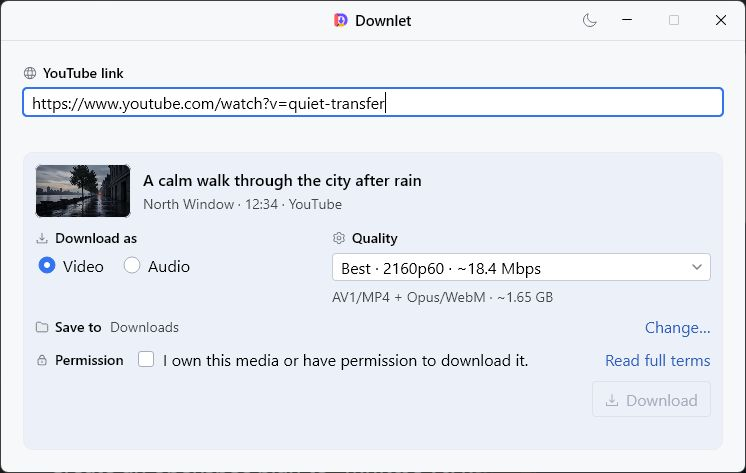
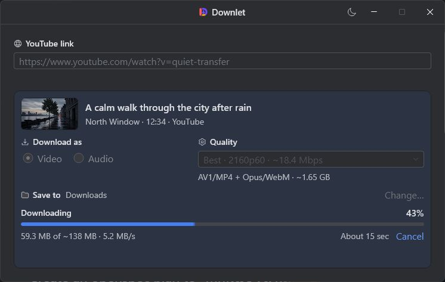

# Downlet

Downlet is a focused Windows desktop app for downloading one accessible YouTube video or audio item at a time. It keeps yt-dlp and FFmpeg details out of the interface while preserving truthful progress, explicit consent, and a recoverable download flow.

Windows 10 or 11 x64 is required. Downlet includes its own trimmed runtime, so system Java is not required.

<p align="center">
  
  
</p>

## Install

| Channel | Command or artifact | Status |
| --- | --- | --- |
| GitHub Releases | `Downlet-<version>-windows-x64-portable.exe` | Primary portable download |
| WinGet | `winget install --id Downlet.Downlet --exact --scope user` | Available after WinGet review |
| Chocolatey | `choco install downlet` | Available after Chocolatey review |

The portable EXE runs without installation or elevation. The MSI used by WinGet and Chocolatey installs for the current user, adds one Start Menu entry, and appears in Apps & Features. It creates no desktop shortcut and does not modify `PATH`.

The one-time `v0.0.1-rc.1` bootstrap release is unsigned and exists only to validate the public release pipeline. Do not submit it to package managers. Stable releases are blocked until trusted signing works.

## What Downlet does

- Resolves one YouTube video and presents useful video or audio choices without backend format IDs.
- Downloads video with its selected quality and source audio, then merges separate streams when needed.
- Saves original audio without conversion or converts it to MP3 at the selected quality.
- Shows transferred bytes, total size when known, current speed, approximate ETA, and native Windows taskbar progress.
- Keeps transfer progress monotonic across separate video and audio streams.
- Supports cancellation with transactional cleanup. A completed file is published only after the download and processing command succeeds.
- Categorizes availability, network, storage, processing, tool, and unknown failures with focused recovery actions.
- Shows the exact completed path and selects the saved file in Explorer through **Show in folder**.

## External tools

Downlet does not bundle yt-dlp, FFmpeg, or FFprobe. On first use it explains why they are needed and downloads pinned copies only after explicit consent. Every managed download is checked against a pinned SHA-256 hash.

If a Downlet-managed tool is damaged, Downlet repairs that pinned copy once without asking for consent again. Bundled QuickJS support repairs locally without a network request. Downlet never replaces invalid override or `PATH` tools.

See [third-party notices](THIRD_PARTY_NOTICES.md) for versions, licenses, and upstream sources.

## Privacy

Downlet has no telemetry, analytics, account, or persistent download history. Resolved media details are cached only in memory for the current session.

After a valid link is entered, Downlet requests lightweight title, channel, and thumbnail data from YouTube. Media transfer starts only after the user chooses Download. Missing yt-dlp and FFmpeg tools are downloaded only after consent; repair uses the same pinned upstream artifacts.

This program will not transfer any information to other networked systems unless specifically requested by the user or the person installing or operating it.

## Release size

Each release includes `release-metadata.json` with exact signed artifact sizes and MSI identity. The current unsigned v0.1.0 baseline is:

| Artifact | Size |
| --- | ---: |
| Portable EXE | 58.6 MiB |
| Per-user MSI | 73.7 MiB |
| Extracted application payload | 160.8 MiB |

The portable release has a 90 MiB hard ceiling and a 65 MiB strong target.

## Verify a release

Download both the artifact and `SHA256SUMS.txt` from the same release. In PowerShell:

```powershell
Get-FileHash .\Downlet-0.1.0-windows-x64-portable.exe -Algorithm SHA256
Get-AuthenticodeSignature .\Downlet-0.1.0-windows-x64-portable.exe | Format-List Status,SignerCertificate,TimeStamperCertificate
```

Compare the hash with `SHA256SUMS.txt`. A stable artifact must report a valid Authenticode signature and a timestamp certificate.

With GitHub CLI installed:

```powershell
$repository = gh repo view --json nameWithOwner --jq .nameWithOwner
gh attestation verify .\Downlet-0.1.0-windows-x64-portable.exe --repo $repository
```

Free code signing provided by SignPath.io, certificate by SignPath Foundation.

See the [code-signing policy](CODE_SIGNING.md) and [release guide](RELEASE.md) for the full trust and publication process.

## Responsible use

Downlet grants no rights to media. Download only content you own or have permission to download, and follow applicable law and YouTube's terms. Downlet does not bypass sign-in, access controls, geographic restrictions, or private-media permissions.

## License

Downlet's original source code is available under the [Zero-Clause BSD license](LICENSE). Redistributed and downloaded components retain their own licenses.
