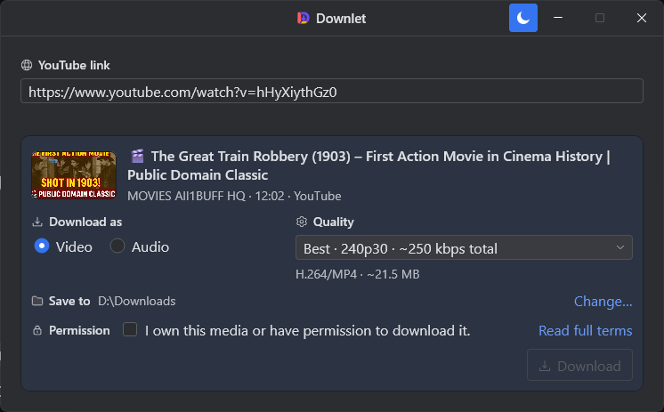
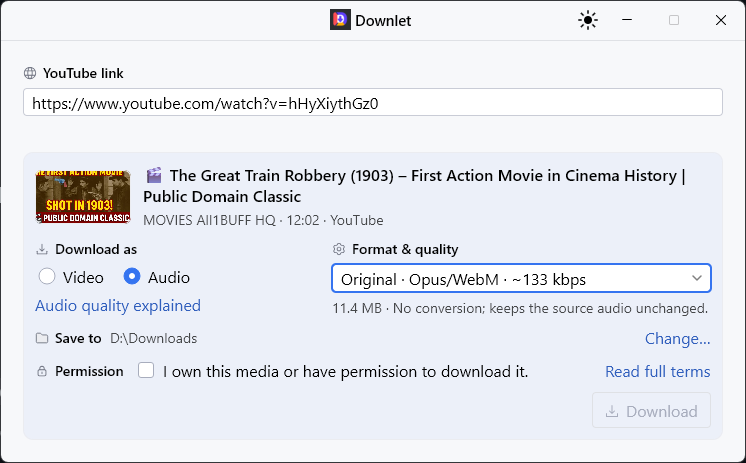

# Downlet

<p align="center">
  
</p>

<p align="center">
  <a href="LICENSE"></a>
  <a href="https://github.com/zantoichi/Downlet/releases"></a>
</p>

A focused, open source Windows app for downloading accessible YouTube videos and audio.

<p align="center">
  
  
</p>

## Download

[Download the latest preview](https://github.com/zantoichi/Downlet/releases). It includes a portable EXE and a per-user MSI for Windows 10 and 11 x64.

The preview is unsigned, so Windows may show an unknown-publisher or SmartScreen warning.

## Use Downlet

1. Paste an accessible YouTube link.
2. Choose Video or Audio, then select the format, quality, and folder.
3. Accept the permission statement and click Download.

Original audio keeps the source codec and container. MP3 converts the source at the selected quality.

On first use, Downlet asks for permission to download yt-dlp and FFmpeg.

If YouTube asks for verification, choose a browser where the video plays. Downlet uses that browser session for the current link and does not save its cookies.

Download media only when you own it or have permission to use it. Downlet does not bypass sign-in, access controls, geographic restrictions, or private-media permissions.

## Build from source

The project uses the Gradle wrapper and resolves its required JDK toolchain automatically.

```powershell
.\gradlew.bat --no-daemon --console=plain check smokeTest
```

To build the Windows portable EXE and per-user MSI:

```powershell
.\gradlew.bat --no-daemon --console=plain packageWindowsSingleExe packageMsi '-PdownletVersion=0.0.1'
```

Downlet is licensed under the [Zero-Clause BSD license](LICENSE). See [third-party notices](THIRD_PARTY_NOTICES.md) for bundled and downloaded components.
